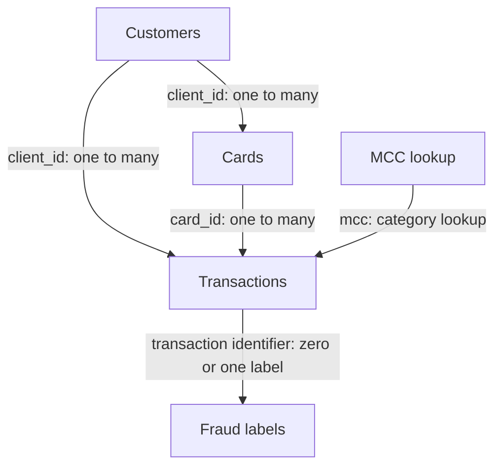

# Banking Transaction Fraud Analytics and Risk Decision Support System

An independent Banking and FinTech analytics project connecting customer profiles, payment cards, merchant categories and transaction records to investigate financial behaviour and develop an evidence based approach to fraud investigation prioritisation.

**Status:** In progress. Data cleaning and the recorded interim validation checkpoint are complete. Exploratory data analysis is underway. Predictive models, business impact simulations and stakeholder dashboards are planned, not completed results.

**Last updated:** 1 September 2026  
**Author:** Divyansh Doshi  
**Repository:** [financial_transaction_analytics_platform](https://github.com/divyansh2703/financial_transaction_analytics_platform)

## Contents

1. [Project overview](#project-overview)
2. [Business objectives and intended users](#business-objectives-and-intended-users)
3. [Dataset and relationships](#dataset-and-relationships)
4. [Results established so far](#results-established-so-far)
5. [Business questions and analytical approach](#business-questions-and-analytical-approach)
6. [Technology and implementation](#technology-and-implementation)
7. [Model development and evaluation plan](#model-development-and-evaluation-plan)
8. [Business metrics and impact measurement](#business-metrics-and-impact-measurement)
9. [Dashboard and decision support plan](#dashboard-and-decision-support-plan)
10. [Repository guide and reproduction](#repository-guide-and-reproduction)
11. [Project roadmap and evidence records](#project-roadmap-and-evidence-records)
12. [Limitations and responsible use](#limitations-and-responsible-use)
13. [Next milestones](#next-milestones)
14. [Author and reuse](#author-and-reuse)

## Project overview

This project follows the work of an analyst receiving a large unfamiliar banking dataset: establish what the records represent, investigate their quality, build trustworthy analytical tables, identify meaningful business questions, evaluate possible solutions and communicate recommendations with measurable evidence.

The aim is more than a dashboard or a standalone machine learning model. The intended final output is a reusable analytical workflow that connects data preparation, customer and transaction analysis, risk prioritisation, explainability, operational scenarios and stakeholder reporting.

The current working direction is transaction fraud analytics and investigation prioritisation. Customer financial behaviour and payment activity provide the broader analytical context. The final problem definition, model target and intervention remain subject to the evidence produced during exploration.

This is a portfolio project simulating an organisational analytics workflow. It is not a deployed banking product, and the teams described below are intended users rather than claimed client engagements.

## Business objectives and intended users

The central decision is:

> How can validated transaction and customer information help identify investigation priorities, while making the tradeoff between fraud capture, false alerts and review capacity explicit?

The project is designed to:

1. Establish reliable relationships between customers, cards, transactions, merchant categories and available fraud labels.
2. Understand customer financial characteristics and payment behaviour before proposing risk segments.
3. Identify patterns associated with labelled fraud without confusing association with causation.
4. Compare a transparent baseline with more advanced methods only when modelling adds measurable value.
5. Evaluate investigation strategies against an explicit review capacity and documented cost assumptions.
6. Produce understandable dashboards, recommendations and reusable processing components.

| Intended audience | Decision supported | Intended output |
| --- | --- | --- |
| Fraud Operations | Which transactions should receive investigation priority? | Ranked review candidates, supporting indicators and threshold comparisons |
| Risk Management | What tradeoff exists between missed fraud and false alerts? | Evaluation metrics, concentration analysis and model limitations |
| Finance | What financial exposure could an intervention address? | Clearly defined value measures and sensitivity analysis, not assumed realised savings |
| Compliance | Can analytical rules and decisions be traced and reviewed? | Validation evidence, documented assumptions and an audit trail |
| Analytics and Data Engineering | Can another analyst reproduce and refresh the work? | Reusable scripts, validated tables, configuration and execution documentation |
| Executive leadership | What action is supported by the evidence? | A concise business case, operational implications and monitoring KPIs |

## Dataset and relationships

The current data comprises five related tables. The counts below refer to the recorded cleaned interim checkpoint, not automatically to every future dataset version.

| Entity | Raw input under `data/raw/` | Cleaned output under `data/interim/` | Records | Grain |
| --- | --- | --- | ---: | --- |
| Customers | `users_data.csv` | `users_cleaned.csv` | 2,000 | One customer |
| Cards | `cards_data.csv` | `cards_cleaned.csv` | 6,146 | One card |
| Transactions | `transactions_data.csv` | `transactions_cleaned.csv` | 13,305,915 | One transaction |
| Merchant categories | `mcc_codes.json` | `mcc_codes_cleaned.csv` | 109 | One MCC lookup code |
| Fraud labels | `train_fraud_labels.json` | `fraud_labels_cleaned.csv` | 8,914,963 | One available transaction label |

Customers have 14 columns in the recorded users dataset. Customer and card identifiers are normalised as `client_id` and `card_id` in the cleaned relationships. The raw transaction identifier is `id`; downstream joins must use the identifier name and type actually produced by the cleaning scripts.

### How the tables connect



The transaction table contains both customer and card references. This supports a separate ownership check: a valid customer ID and a valid card ID are not sufficient unless that card belongs to that customer.

Fraud labels annotate transactions; their record count must not be added to transaction volume. Joining the labels must preserve the transaction grain and retain a separate state for transactions without a label.

### Label coverage

| Label state | Transactions |
| --- | ---: |
| Labelled `Yes` | 13,332 |
| Labelled `No` | 8,901,631 |
| All labelled transactions | 8,914,963 |
| Transactions without an available label | 4,390,952 |
| All transactions | 13,305,915 |

The counts reconcile exactly:

```text
13,332 + 8,901,631 = 8,914,963
13,305,915 - 8,914,963 = 4,390,952
```

Missing fraud labels are unknown outcomes, not evidence of nonfraud. Supervised training and evaluation must use eligible labelled records. The label coverage pattern across time, customers and payment channels must be investigated before generalising results to the full transaction population.

### Data provenance and access

The original publisher, source URL, dataset version, licence and whether the records are synthetic remain to be documented in this README. No claim is made here that the data represents verified real banking customers.

The full datasets are intentionally excluded from Git. Anyone reproducing the analysis must obtain the authorised source files separately and place them at the paths above. Source citation, permitted use and redistribution terms must be confirmed before distributing any sample data.

## Results established so far

The results in this section are data preparation, validation and early feature findings. They are not model performance or realised business impact.

### Recorded validation checkpoint

The independent interim validator completed **56 checks: 56 passed and 0 failed**.

Recorded run identifier: `394cae10-7633-456e-9af7-df1158945f94`.

Evidence artefacts: [validation script](src/validate_interim_data.py) and [interim validation report](logs/interim_validation_report.csv).

| Check | Recorded result | What it establishes |
| --- | --- | --- |
| Customer identifier uniqueness | 2,000 distinct customer identifiers | One customer per recorded users row |
| Card identifier uniqueness | 6,146 distinct card identifiers | One card per recorded cards row |
| Transaction identifier uniqueness | 13,305,915 distinct transaction identifiers | No duplicate transaction identifiers at this checkpoint |
| Card references to unknown customers | 0 | Valid customer references in the cards table |
| Customer card count mismatches | 0 | Stored customer card counts reconcile with linked card records under the tested rule |
| Transaction references to unknown customers | 0 | Valid customer references in the transaction table |
| Transaction references to unknown cards | 0 | Valid card references in the transaction table |
| Transaction card ownership mismatches | 0 | Transaction customer and card ownership are consistent |
| Users monetary transformation failures | 0 | No failures under the tested monetary transformation check |
| MCC identifier uniqueness | 109 distinct codes | Unique merchant category lookup keys |
| Fraud label identifier uniqueness | 8,914,963 distinct identifiers | At most one available label per labelled transaction |
| Fraud label IDs absent from transactions | 0 | All supplied labels refer to an existing transaction |
| Unexpected fraud label values | 0 | Labels conform to the accepted values |
| Fraud label reconciliation | Passed | Label counts reconcile with the recorded totals |
| Before account opening flag mismatches | 0 | Stored flags match independently recalculated logic |
| After card expiry flag mismatches | 0 | Stored flags match independently recalculated logic |
| Channel and location flag mismatches | 0 | Stored flags match independently recalculated logic |
| `card_number` and `cvv` in cleaned cards | Neither present | These sensitive fields are excluded from the cleaned cards table |

Zero flag mismatches do not mean that zero transactions were flagged. They mean that the flags agree with the tested logic. Counts of the underlying flagged transactions must be reported separately.

Passing the validator demonstrates compliance with its implemented rules. It does not prove that every record is accurate, that the data is representative, or that every possible quality problem has been found.

### Credit card aggregation checkpoint

| Finding | Customers |
| --- | ---: |
| Customers identified as holding a credit card | 1,313 |
| Credit card holders with a zero summed credit limit | 12 |
| Customers with at least one zero limit credit card | 25 |

These findings identify cases requiring interpretation before credit limit based analysis. A zero limit is not automatically a missing value or proof of financial distress. Total linked card counts must also be distinguished from credit card only counts.

### What has not yet been measured

There is currently no validated result for fraud model precision, recall, fraud value capture, financial exposure, investigation workload reduction, processing time improvement or dashboard adoption.

No model has been selected as the final solution. Earlier illustrative targets are not project results and are not used as evidence in this README.

## Business questions and analytical approach

| Question | Why it matters | Current position |
| --- | --- | --- |
| How are income, debt and debt relative to income distributed? | Establish a financial profile without allowing averages to hide concentration or extreme values | Initial visual exploration underway |
| How do card ownership and credit limits differ across customers? | Identify aggregation issues and understand available credit indicators | Initial feature checkpoint recorded |
| How does transaction activity vary by time, merchant category and channel? | Establish normal activity and identify areas worth investigating | Further analysis planned |
| Where are labelled fraud cases concentrated? | Assess whether useful investigation priorities exist | Analysis planned |
| Which transactions lack labels, and is the labelled subset representative? | Protect training, evaluation and interpretation from selection bias | Coverage count established; representativeness analysis pending |
| Which lifecycle or channel flags reflect data issues rather than suspicious behaviour? | Avoid converting a quality exception directly into a fraud conclusion | Flag consistency validated; interpretation pending |
| Can a candidate approach outperform a transparent baseline at comparable review capacity? | Test whether modelling would improve a real operational decision | Conditional modelling stage |
| Can the same workflow process a new data delivery reproducibly? | Demonstrate maintainability beyond a single notebook | Script components exist; full refresh acceptance test planned |

### Exploration principles

Exploration progresses from structure and distributions to relationships, time patterns, customer behaviour, transaction behaviour and risk hypotheses.

Initial income, debt and debt ratio distributions are examined with separate histograms and marked means and medians. Outliers are not automatically removed, capped or transformed. Any later treatment must be justified and recorded.

Statistical testing will consider effect size, practical significance, uncertainty and potential confounding. A pattern observed in a chart is not by itself evidence of causation or a useful intervention.

### Financial features under investigation

| Feature | Definition or interpretation | Important qualification |
| --- | --- | --- |
| `debt_to_annual_income_ratio` | Total debt divided by annual income | A debt balance measure, not a monthly debt repayment ratio; zero income requires explicit handling |
| `years_to_retirement` | Retirement age minus current age | Negative values require contextual interpretation rather than automatic removal |
| `credit_card_count` | Count of cards classified as credit cards for each customer | Must not be confused with the count of all card types |
| `total_credit_card_limit` | Sum of relevant credit card limits for each customer | Zero limits and card type filtering need documented rules |
| `average_credit_limit_per_card` | Total credit card limit divided by credit card count | Undefined when no eligible credit card exists |
| `credit_limit_to_income_ratio` | Total credit card limit divided by annual income | Indicates available credit relative to income; does not measure utilisation |

These are analytical features, not validated credit approval criteria or established predictors of default.

## Technology and implementation

| Technology | Role | Status in this project |
| --- | --- | --- |
| Python | Cleaning, validation, exploration and reusable processing scripts | Implemented components and active analysis |
| pandas | Tabular data handling and quality checks | Used in the established Python workflow |
| Jupyter and VS Code | Exploration in notebooks and reusable code in scripts | Existing working artefacts |
| Git and GitHub | Version control for code and lightweight project artefacts | Repository publishing completed; full datasets excluded |
| MySQL | Analytical schema, joins, aggregations, window functions and reusable queries | Planned analytical layer |
| Excel and Power Query | Auditable business analysis, summaries and refreshable transformations | Planned workflow |
| NumPy, Matplotlib, SciPy and statsmodels | Numerical analysis, visualisation and statistical testing | Use according to analytical need; completed coverage is not claimed |
| scikit-learn and candidate boosting libraries | Baselines and candidate predictive methods | Conditional future modelling |
| SHAP or another suitable explanation method | Explain selected model behaviour and individual predictions | Conditional on final model choice |
| Tableau | Stakeholder dashboards and operational scenario comparisons | Planned |

Python 3.12.11 was recorded in the development setup. A complete pinned dependency manifest and a fresh environment reproduction test remain to be published.

Excel will consume suitable summaries or extracts rather than requiring the entire transaction table to fit into a worksheet. Tools are included when they serve a distinct analytical purpose, not to repeat the same analysis in every application.

### Data handling established in the validation workflow

1. Identifiers are normalised as text and surrounding whitespace is removed.
2. Blank text and invalid values are distinguished where the checks require it.
3. Monetary validation uses exact integer cents rather than floating point conversion; missing monetary values remain missing.
4. Transaction timestamps retain date and time information.
5. Card account opening and expiry fields are interpreted at their recorded month and year precision.
6. Transaction validation runs in chunks to support the dataset size.
7. The independent validator checks the cleaned files without modifying the source files.

Accepted transaction channel values are `Chip Transaction`, `Online Transaction` and `Swipe Transaction`.

## Model development and evaluation plan

Machine learning is conditional on a defensible business problem and usable labels. The proposed target is the supplied transaction fraud outcome, not an inferred default, churn or money laundering outcome.

The planned evaluation process is:

1. Define the scoring decision, eligible population, label availability and review capacity.
2. Audit whether every proposed feature would have been available at the transaction decision time. Current customer or card snapshots must not automatically be treated as historical information.
3. Design a time based evaluation where appropriate. Use a separate customer holdout if the objective includes generalisation to unseen customers.
4. Build a transparent baseline before comparing more complex models.
5. Fit preprocessing and any imbalance treatment only on the training data.
6. Select thresholds using validation data and operational constraints, not the final test set.
7. Report precision, recall, false alerts, the precision recall curve and clearly defined cost or capacity measures. Accuracy alone is not sufficient for the observed label imbalance.
8. Compare performance across relevant cohorts and periods and investigate failure cases.
9. Explain the selected approach and document limitations, calibration where relevant and monitoring requirements.
10. Freeze the chosen design before final test evaluation.

Model count, algorithm choice and target performance are not predetermined achievements. Complexity must earn its place through an appropriate comparison.

## Business metrics and impact measurement

The KPI framework connects analytical outputs to decisions. A metric is not considered a result until its population, calculation, baseline and evidence have been recorded.

| Metric | Definition | Interpretation rule |
| --- | --- | --- |
| Label coverage | Labelled transactions divided by all eligible transactions | Report separately from fraud incidence |
| Labelled fraud incidence | Fraud labelled transactions divided by all labelled transactions | Do not put unlabelled records in the nonfraud denominator |
| Review rate | Flagged transactions divided by eligible scored transactions | State the evaluation population and threshold |
| Fraud case recall | True positives divided by true positives plus false negatives | Measures capture of labelled fraud cases |
| Alert precision | True positives divided by true positives plus false positives | Measures fraud yield within the review queue |
| False positive rate | False positives divided by false positives plus true negatives | Not the same as the nonfraud share of alerts |
| Fraud value capture | Eligible flagged fraud value divided by total eligible fraud value | Define currency, refunds, negative amounts and the value measure first |
| Review volume reduction | Baseline review count minus candidate review count, divided by baseline review count | Use the same cohort and a stated performance constraint |
| Processing time improvement | Baseline runtime minus candidate runtime, divided by baseline runtime | Compare the same workload and execution conditions |

Ratios must retain their exact numerator and denominator in the supporting records. A zero denominator produces an undefined metric, not an invented zero value.

### Business impact simulation

The planned scenarios compare review thresholds, fraud capture, false alerts and operational capacity. Any assumed investigation cost, recoverable loss or intervention effectiveness will be identified explicitly and tested for sensitivity.

The comparison baseline must be operationally meaningful. Reviewing a selected fraction of all transactions is not automatically evidence of equivalent staff workload savings. Queue size and reviewer effort may differ.

Transaction amount is not automatically confirmed loss, recoverable value or profit. Simulated financial benefits will remain labelled as simulated; no realised revenue, cost saving or fraud prevention impact is claimed.

## Dashboard and decision support plan

| Dashboard area | Intended content | Decision supported |
| --- | --- | --- |
| Executive overview | Data coverage, transaction activity, risk indicators and limitations | Understand the scale and readiness of the analysis |
| Customer and card analysis | Income, debt, card holdings and relevant credit limit measures | Explore financial characteristics without assigning unsupported risk labels |
| Transaction analysis | Time, merchant category and channel patterns | Identify changes and areas for further investigation |
| Fraud analysis | Label coverage, fraud counts and supported segment comparisons | Understand the observed labelled fraud population |
| Investigation scenarios | Thresholds, review volumes, capture and false alerts | Compare candidate investigation strategies |
| Data quality | Validation outcomes, exceptions and refresh information | Decide whether outputs are suitable for use |

Dashboards will distinguish observed records, model estimates and scenario assumptions. A future dashboard demonstration must not be described as deployed or adopted by a real banking team without evidence.

## Repository guide and reproduction

### Existing project artefacts

| Path | Purpose |
| --- | --- |
| [src/clean_reference_data.py](src/clean_reference_data.py) | Reference data cleaning component |
| [src/clean_transactions.py](src/clean_transactions.py) | Transaction cleaning component |
| [src/validate_interim_data.py](src/validate_interim_data.py) | Independent validation of cleaned interim datasets |
| [notebooks/Fincance_Project.ipynb](notebooks/Fincance_Project.ipynb) | Exploratory analysis notebook; the current filename is preserved |
| [logs/interim_validation_report.csv](logs/interim_validation_report.csv) | Recorded validation output |
| [.gitignore](.gitignore) | Exclusion of local datasets and other files that should not be committed |
| `data/raw/` | Local source inputs; excluded from Git |
| `data/interim/` | Local cleaned intermediate tables; excluded from Git |
| `notebooks/Notebook_outputs_eda/` | Existing exploratory figure exports |

Current figure artefacts include the [boxplot](notebooks/Notebook_outputs_eda/boxplot.png), [credit score and ratio scatter plot](notebooks/Notebook_outputs_eda/creditscore_vs_ratio_scatter.png), and [total debt and current age scatter plot](notebooks/Notebook_outputs_eda/totaldebt_vs_currentage.png). Their presence is not a substitute for documented interpretation or statistical evidence.

Planned additions include analytical SQL, Excel and Power Query deliverables, Tableau workbooks, a data dictionary, configuration, automated tests and model artefacts if justified. These should be added as implemented rather than presented as existing components.

### Obtain the code and prepare an environment

```bash
git clone https://github.com/divyansh2703/financial_transaction_analytics_platform.git
cd financial_transaction_analytics_platform
python3 -m venv .venv
source .venv/bin/activate
```

The environment activation command above is for macOS or Linux. Dependency installation is not yet documented as a tested complete command. Review the script and notebook imports and use a dedicated environment; a pinned dependency manifest is an open reproduction task.

### Prepare the local data

Obtain the authorised source files and place them under `data/raw/` using the names in the dataset table. Keep the raw inputs unchanged. Record their source version and checksums when formalising the data release.

The intended execution order is reference cleaning, transaction cleaning, interim validation, then exploration. Exact command line options for the two cleaners remain to be documented from their current implementation; no unverified cleaner invocation is supplied here.

### Run the recorded interim validation command

Once dependencies and all five cleaned interim files are available, the previously executed validator invocation is:

```bash
python src/validate_interim_data.py \
  --users data/interim/users_cleaned.csv \
  --cards data/interim/cards_cleaned.csv \
  --transactions data/interim/transactions_cleaned.csv \
  --mcc data/interim/mcc_codes_cleaned.csv \
  --fraud data/interim/fraud_labels_cleaned.csv
```

The recorded checkpoint returned `PASS` with 56 checks passed and 0 failed. Rerun and inspect the output for each data delivery; the previous result is not a guarantee for new inputs. This README records an earlier successful run rather than claiming a fresh execution of the full repository.

Open `notebooks/Fincance_Project.ipynb` in Jupyter or VS Code for exploration after validation. Check its paths and execution order before running cells.

### Data and Git hygiene

Full raw, interim and generated datasets should remain outside Git history. Store small documentation, code and reviewed output artefacts in the repository instead.

Check the ignore rules and tracked data before committing:

```bash
git check-ignore -v --no-index data/raw/transactions_data.csv data/interim/transactions_cleaned.csv
git ls-files -- data/raw data/interim
```

Dataset payloads should not appear in the second output. An ignore rule does not remove a file from earlier commits. Also inspect notebook outputs, screenshots and reports before publishing: they can expose sensitive records even when the underlying CSV files are ignored.

## Project roadmap and evidence records

| Phases | Work | Current status |
| --- | --- | --- |
| 1 to 8 | Dataset assessment, context, environment, ingestion, profiling, quality assessment, cleaning and validation | Foundation established through the recorded interim checkpoint |
| 9 | Feature understanding | Initial customer and card features established; interpretation continues |
| 10 | Exploratory data analysis | In progress |
| 11 | Formal business question development | Initial questions defined; register to expand with evidence |
| 12 to 16 | SQL, Excel, statistics, behavioural analysis and supported risk analysis | Planned |
| 17 to 20 | Model formulation, development, evaluation and explainability | Conditional on analytical justification |
| 21 and 22 | Business impact simulation and Tableau dashboards | Planned |
| 23 and 24 | Integrated reusable pipeline and testing with new data | Existing scripts provide components; integration and refresh testing remain |
| 25 to 28 | Stakeholder recommendations, executive presentation, portfolio documentation and verified CV achievements | Final deliverables pending; documentation is maintained during development |

The final pipeline is intended to accept a new compatible data delivery without manually rebuilding the analysis. Configuration, schema validation, clear failure messages, logging, repeatable outputs and fresh data tests are acceptance requirements, not claimed completed capabilities.

### Evidence records required by the project

| Record | What it captures |
| --- | --- |
| Project Impact Ledger | Finding, baseline, comparison, exact values, business meaning, limitations and supporting artefact |
| Analytical Decision Log | Decision, reasoning, alternatives, evidence, assumptions and risk |
| Data Quality Scorecard | Completeness, uniqueness, validity, consistency, referential integrity and remaining quality questions |
| Business Question Register | Business question, intended decision, required data, method, metric, finding and recommended action |

These records must accompany the finished analysis. Their maintained file locations will be linked as the corresponding artefacts are published. Every final portfolio claim should trace back to its calculation and evidence.

## Limitations and responsible use

1. **Partial labels:** 4,390,952 transactions have no supplied fraud label. Their outcomes cannot be inferred from missingness.
2. **Class imbalance:** The labelled set contains 13,332 fraud cases and 8,901,631 nonfraud labels. Evaluation must reflect that imbalance.
3. **Validation scope:** Passing implemented checks does not establish universal data correctness, representativeness or suitability for every use case.
4. **Temporal availability:** Customer and card snapshots may not represent the information available at each historical transaction. Feature timing must be audited before modelling.
5. **Zero credit limits:** The documented cases need business interpretation before imputing values or assigning risk meaning.
6. **Data provenance:** Publisher, licence, source version, currency metadata and synthetic status require formal documentation.
7. **Incomplete analytical evidence:** Final date coverage, full field level missingness, anomaly prevalence, segment findings and financial totals are not yet documented here as completed results.
8. **No demonstrated financial intervention:** Transaction value is not a verified loss measure. No monetary savings, prevented fraud or increased profitability has been established.
9. **No production or regulatory claim:** This project is not a regulatory compliance certification, a lending decision system or a production fraud control.
10. **Privacy:** Removing card numbers and CVVs is one safeguard, not a guarantee of anonymisation. Other identifiers, locations, notebook outputs and exports require review before publication.
11. **Reproduction gaps:** Source access documentation, dependency pinning and tested cleaner commands remain outstanding. Full replication from a fresh clone is not yet claimed.

## Next milestones

1. Complete and interpret the initial financial distributions without automatically changing extreme observations.
2. Investigate zero credit limits, denominator handling and the meaning of each financial feature.
3. Document the original data source, permitted use, currency, version and observation period.
4. Record exact cleaner commands, publish dependency specifications and test the setup from a fresh environment.
5. Expand the Business Question Register using evidence from customer and transaction exploration.
6. Investigate label coverage and temporal feature availability before creating a modelling dataset.
7. Build the SQL and business reporting layers for the questions that survive this review.
8. Evaluate any fraud prioritisation approach against a transparent baseline before claiming business value.

Completion means that another analyst can obtain permitted inputs, reproduce the calculations, inspect the assumptions, rerun the pipeline and understand the recommended decision and its limitations.

## Author and reuse

Developed by **Divyansh Doshi** as an independent analytics portfolio project.

[GitHub](https://github.com/divyansh2703) | [LinkedIn](https://www.linkedin.com/in/divyansh-doshi/) | [Portfolio](https://divyansh2703.github.io/DivyanshDoshi.github.io/)

Code licensing must be confirmed separately in the repository. Dataset licensing is a separate obligation; this README does not grant permission to redistribute the source data.
